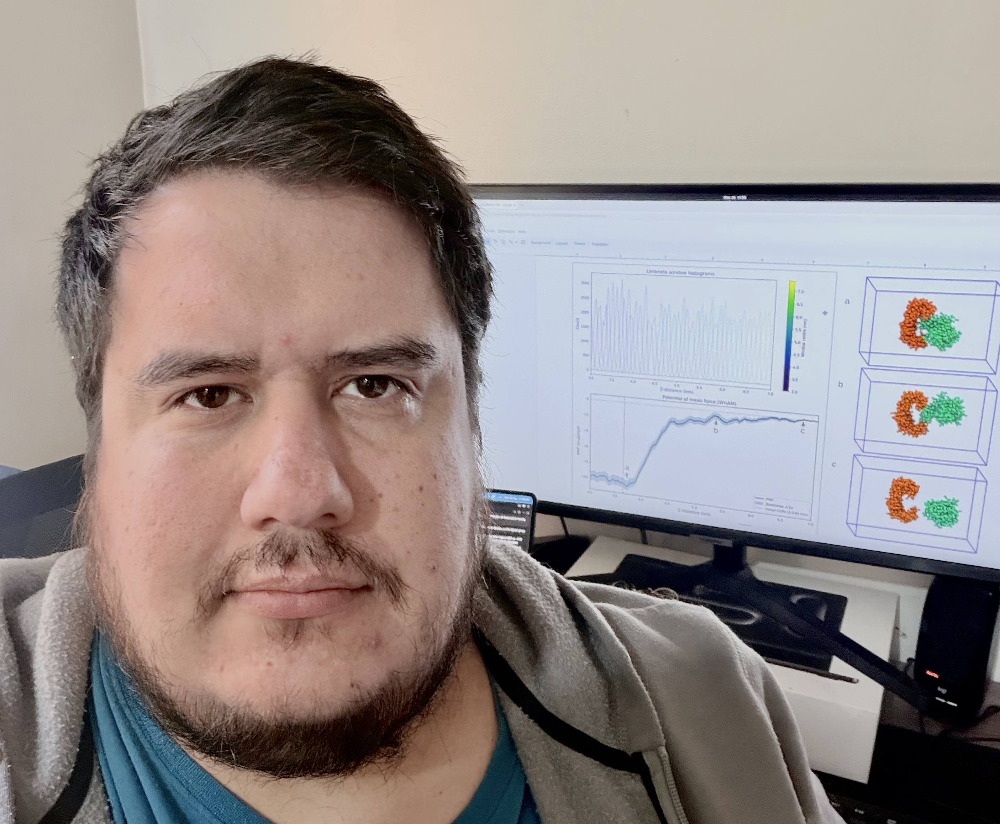

# Pablo Galaz-Davison

**Protein folding, from the energy landscape to how to redo it.**

I am a computational and experimental biophysicist building a research program on
protein folding: how a polypeptide reaches its native structure, why that process
fails in disease, and how to help it externally. My work sits at the interface of 
native-centric simulation, energy-frustration analysis, and hands-on protein biophysics. 
I model the folding pathway, and then test the prediction at the bench.

Currently a postdoctoral researcher at the Center for Bioinformatics, Simulation and Modeling
(CBSM), Universidad de Talca, Chile.

- **[Google Scholar](https://scholar.google.com/citations?user=sdeKPyoAAAAJ)**
- **[Web of Science / ResearcherID KIG-3861-2024](https://www.webofscience.com/wos/author/record/KIG-3861-2024)**
- pablo.galaz [at] utalca.cl

---

## Selected publications

A full list is on [Google Scholar](https://scholar.google.com/citations?user=sdeKPyoAAAAJ).

- Peña-Vilches *et al.* **Identification of 14-3-3 proteins as binding partners of TRP
  channels.** *J. Chem. Inf. Model.* (2026). *Co-corresponding author.*
- González-Higueras *et al.* **A contact-based analysis of local energetic frustration
  dynamics identifies key residues enabling RfaH fold-switch.** *Protein Science* (2024).
- Freiberger *et al.* **Local energetic frustration conservation in protein families and
  superfamilies.** *Nature Communications* (2023).
- Molina *et al.* **Allosteric couplings upon binding of RfaH to transcription elongation
  complexes.** *Nucleic Acids Research* (2022).
- Galaz-Davison *et al.* **Coevolution-derived native and non-native contacts determine
  the emergence of a novel fold in a universally conserved family of transcription
  factors.** *Protein Science* (2022). *First author.*
- Galaz-Davison *et al.* **Differential local stability governs the metamorphic fold
  switch of bacterial virulence factor RfaH.** *Biophysical Journal* (2020). *First
  author — Biophysical Society Paper of the Year.*
- Fecker & Galaz-Davison *et al.* **Active site flexibility as a hallmark for efficient
  PET degradation by* I. sakaiensis *PETase.** *Biophysical Journal* (2018). *Equal
  first author.*

---

## Background

- **Postdoctoral researcher**, CBSM, Universidad de Talca (2024–present)
- **PhD**, Pontificia Universidad Católica de Chile (2023)
- **MSc, Biochemistry**, Universidad de Chile (2017)
- **BSc, Biochemistry**, Universidad de Chile (2015)

16 peer-reviewed publications · h-index 9 · Biophysical Society Paper of the Year (2020) ·
ANID National Doctoral Fellowship (2018–2022)

---

Built with GitHub Pages. Last updated 2026.
